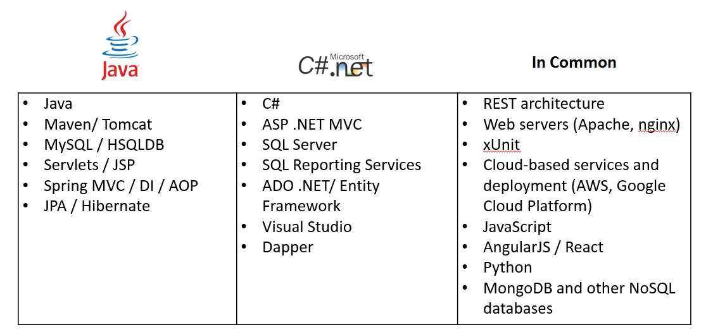
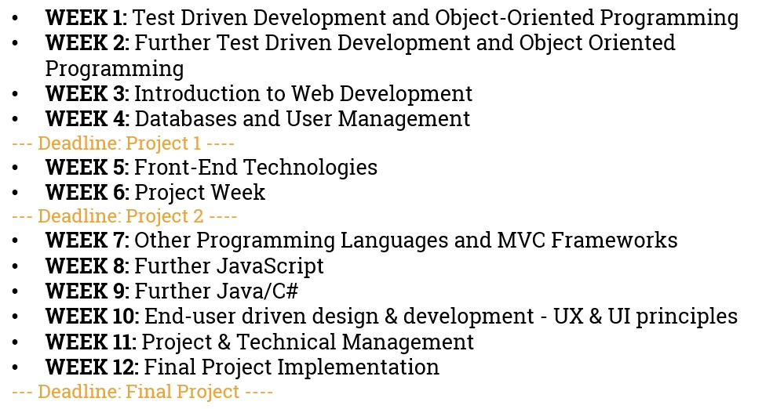

## Program Overview
* Learning Objectives
* Flow and Structure
* Tools and material

## Learning Objectives
* At the end of the program, participants will have:
  * Acquired the appropriate background to code and extend their programming skills and knowledge in new domains
  * Developed a project portfolio containing at least three full-stack applications and various exercises
  * Learnt to use the latest tools and concepts in application developmentwork
  * Worked in a team to design and develop a larger-scale application 
  
* Building on the acquired knowledge, participants will be able to: 
  * Develop full-stack applications using the C# or Java programming languages
  * Start working as full-stack entry-level application developers
  

## Program Overview 

## Technologies 

## Curriculum 

## Tools and material
